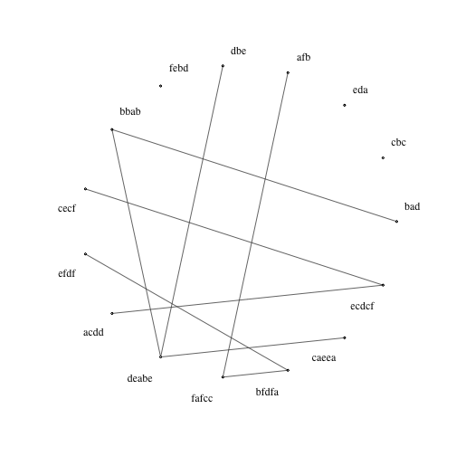
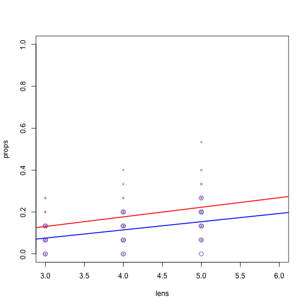
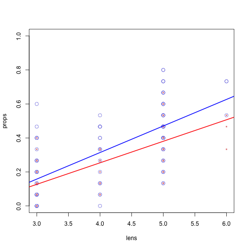
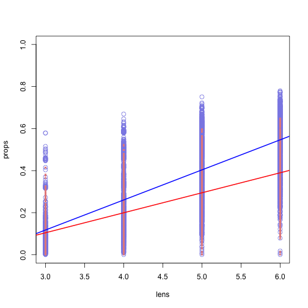

Analysis for Cornish et al. (submitted)
============================================================================================

"In order to determine whether string sets are being acquired more faithfully over time, we calculated error between generations in terms of the normalized edit distance"


```r
# setwd('/Users/rickdale/Dropbox/projects/studies/rickmorten/cornishetal/paper/newstuff/newdata/')
library(lme4)
```

```
## Warning: package 'lme4' was built under R version 3.0.2
```

```
## Loading required package: Matrix
```

```
## Warning: package 'Matrix' was built under R version 3.0.2
```

```
## Loading required package: Rcpp
```

```
## Warning: package 'Rcpp' was built under R version 3.0.2
```

```r
mindists = matrix(nrow=8,ncol=10)
numzeros = matrix(nrow=8,ncol=10)
avglen = matrix(nrow=8,ncol=10)
for (chain in 1:8) {
  # load this chain file
  strs = read.table(paste('data/chain',chain,'.chain',sep=''),sep='\t')
  for (generation in 2:11) {
    dists = adist(strs[,generation-1],strs[,generation])
    lens = matrix(nchar(as.character(strs[,generation-1])),ncol=15,nrow=15)
    dists = dists/lens # normalized by length
    mindists[chain,generation-1] = mean(apply(dists,1,min)) # simply takes first minimum
    numzeros[chain,generation-1] = sum(apply(dists,1,function(x) {x==0})) # count # of totally correct ones
    avglen[chain,generation-1] = mean(nchar(as.character(strs[,generation])))
  }
}
shft = .1
ms = colMeans(mindists)
sds = apply(mindists,2,sd)
plot(ms,type='b',xlab='Generation',
     ylab='Minimal normalized Levensthein (error)',
     ylim=c(0,.45),main='Error over generations')
segments(1:10,ms+sds/sqrt(10),1:10,ms-sds/sqrt(10))
segments(1:10-shft,ms+sds/sqrt(10),1:10+shft,ms+sds/sqrt(10))
segments(1:10-shft,ms-sds/sqrt(10),1:10+shft,ms-sds/sqrt(10))
```

 

```r
regdata = cbind(which(mindists>-1,arr.ind=T),mindists[which(mindists>-1,arr.ind=T)])
lmo = lmer(regdata[,3]~regdata[,2]+(1+regdata[,2]|regdata[,1]))
```

```
## Warning: Model failed to converge with max|grad| = 0.0121836 (tol = 0.002, component 2)
## Warning: Model failed to converge: degenerate  Hessian with 1 negative eigenvalues
```

```r
coefs = data.frame(summary(lmo)$coefficients)
coefs$p = 2*(1-pnorm(abs(coefs$t.value)));coefs
```

```
##              Estimate Std..Error t.value        p
## (Intercept)   0.35399    0.01894  18.692 0.00e+00
## regdata[, 2] -0.01649    0.00351  -4.696 2.65e-06
```

```r
t.test(mindists[,1]-mindists[,10])
```

```
## 
## 	One Sample t-test
## 
## data:  mindists[, 1] - mindists[, 10]
## t = 5.819, df = 7, p-value = 0.0006506
## alternative hypothesis: true mean is not equal to 0
## 95 percent confidence interval:
##  0.1238 0.2932
## sample estimates:
## mean of x 
##    0.2085
```

```r
mean(mindists[,1]);sd(mindists[,1])
```

```
## [1] 0.391
```

```
## [1] 0.03938
```

```r
mean(mindists[,10]);sd(mindists[,10])
```

```
## [1] 0.1825
```

```
## [1] 0.0752
```

"The boost in overall accuracy translates into a significant increase in the number of correctly recalled items"


```r
ms = colMeans(numzeros)
sds = apply(numzeros,2,sd)
plot(ms,type='b',xlab='Generation',ylab='Number of exact reproductions',
     ylim=c(0,9),main='Correct strings over generations')
segments(1:10,ms+sds/sqrt(10),1:10,ms-sds/sqrt(10))
segments(1:10-shft,ms+sds/sqrt(10),1:10+shft,ms+sds/sqrt(10))
segments(1:10-shft,ms-sds/sqrt(10),1:10+shft,ms-sds/sqrt(10))
```

 

```r
regdata = cbind(which(numzeros>-1,arr.ind=T),numzeros[which(numzeros>-1,arr.ind=T)])
lmo = lmer(regdata[,3]~regdata[,2]+(1+regdata[,2]|regdata[,1]))
coefs = data.frame(summary(lmo)$coefficients)
coefs$p = 2*(1-pnorm(abs(coefs$t.value)));coefs
```

```
##              Estimate Std..Error t.value         p
## (Intercept)    3.9000    0.49926   7.812 5.551e-15
## regdata[, 2]   0.2977    0.08175   3.642 2.706e-04
```

```r
t.test(numzeros[,1]-numzeros[,10])
```

```
## 
## 	One Sample t-test
## 
## data:  numzeros[, 1] - numzeros[, 10]
## t = -4.732, df = 7, p-value = 0.002128
## alternative hypothesis: true mean is not equal to 0
## 95 percent confidence interval:
##  -6.561 -2.189
## sample estimates:
## mean of x 
##    -4.375
```

```r
mean(numzeros[,1]);sd(numzeros[,1])
```

```
## [1] 3.5
```

```
## [1] 0.7559
```

```r
mean(numzeros[,10]);sd(numzeros[,10])
```

```
## [1] 7.875
```

```
## [1] 2.416
```

"Importantly, the improved learnability did not come at the cost of a collapse of the string sets into very short sequences"


```r
ms = colMeans(avglen)
sds = apply(avglen,2,sd)
plot(ms,type='b',xlab='Generation',ylab='Average string length',
     ylim=c(0,4.5),main='Average length of strings')
segments(1:10,ms+sds/sqrt(10),1:10,ms-sds/sqrt(10))
segments(1:10-shft,ms+sds/sqrt(10),1:10+shft,ms+sds/sqrt(10))
segments(1:10-shft,ms-sds/sqrt(10),1:10+shft,ms-sds/sqrt(10))
```

 

```r
regdata = cbind(which(avglen>-1,arr.ind=T),avglen[which(avglen>-1,arr.ind=T)])
lmer(regdata[,3]~regdata[,2]+(1+regdata[,2]|regdata[,1]))
```

```
## Linear mixed model fit by REML ['lmerMod']
## Formula: regdata[, 3] ~ regdata[, 2] + (1 + regdata[, 2] | regdata[, 1])
## REML criterion at convergence: -28.18
## Random effects:
##  Groups       Name         Std.Dev. Corr 
##  regdata[, 1] (Intercept)  0.1324        
##               regdata[, 2] 0.0404   -0.05
##  Residual                  0.1553        
## Number of obs: 80, groups:  regdata[, 1], 8
## Fixed Effects:
##  (Intercept)  regdata[, 2]  
##       3.9189        0.0272
```

```r
lmo = lmer(regdata[,3]~regdata[,2]+(1+regdata[,2]|regdata[,1]))
coefs = data.frame(summary(lmo)$coefficients)
coefs$p = 2*(1-pnorm(abs(coefs$t.value)));coefs
```

```
##              Estimate Std..Error t.value       p
## (Intercept)   3.91889    0.05999   65.32 0.00000
## regdata[, 2]  0.02717    0.01552    1.75 0.08005
```

```r
t.test(avglen[,1]-avglen[,10])
```

```
## 
## 	One Sample t-test
## 
## data:  avglen[, 1] - avglen[, 10]
## t = -2.27, df = 7, p-value = 0.05745
## alternative hypothesis: true mean is not equal to 0
## 95 percent confidence interval:
##  -0.56143  0.01143
## sample estimates:
## mean of x 
##    -0.275
```

```r
mean(avglen[,1]);sd(avglen[,1])
```

```
## [1] 3.933
```

```
## [1] 0.1553
```

```r
mean(avglen[,10]);sd(avglen[,10])
```

```
## [1] 4.208
```

```
## [1] 0.3196
```

"Figure 2 indicates that the amount of reuse of chunks (structure) does increase over time"


```r
bitrifound = function(s1) { 
  bigs = unlist(strsplit(s1,""))
  bigs = unique(cbind(bigs[1:(length(bigs)-1)],bigs[2:length(bigs)]))
  nbigs = 0;totbigs = data.frame()
  for (s2 in strings) { # loop through all strings, comparing bigrams... determine # of shared bigrams across all
    s2 = unlist(strsplit(s2,""))
    s2 = unique(cbind(s2[1:(length(s2)-1)],s2[2:length(s2)]))
    all = rbind(bigs,s2)
    nbigs = nbigs + dim(all)[1] - dim(unique(all))[1] # total bigrams shared
    totbigs = rbind(totbigs,s2)
  }
  ntris = 0;tottris = data.frame()
  if (nchar(s1)>=3) {
    tris = unlist(strsplit(s1,""))
    tris = unique(cbind(tris[1:(length(tris)-2)],tris[2:(length(tris)-1)],tris[3:length(tris)]))
    for (s2 in strings[nchar(strings)>=3]) { # loop through only those that had trigrams 
      s2 = unlist(strsplit(s2,""))
      s2 = unique(cbind(s2[1:(length(s2)-2)],s2[2:(length(s2)-1)],s2[3:length(s2)]))
      all = rbind(tris,s2)
      ntris = ntris + dim(all)[1] - dim(unique(all))[1] # total trigrams shared
      tottris = rbind(tottris,s2)
    }
  }  
  return(ntris/dim(unique(tottris))[1]+nbigs/dim(unique(totbigs))[1])
  #return(ntris+nbigs)
}

ACS = matrix(nrow=8,ncol=10)
for (chain in 1:8) {
  # load this chain file
  strs = read.table(paste('data/chain',chain,'.chain',sep=''),sep='\t')
  for (generation in 2:11) {
    strings <<- as.character(strs[,generation-1])
    thisgen = as.character(strs[,generation])
    total_shared = mean(apply(data.frame(thisgen),1,bitrifound))
    ACS[chain,generation-1] = total_shared
  }
}

shft = .1
ms = colMeans(ACS)
sds = apply(ACS,2,sd)
plot(ms,type='b',xlab='Generation',
     ylab='Associated chunk strength',
     ylim=c(0,0.8),main='ACS over generations')
segments(1:10,ms+sds/sqrt(10),1:10,ms-sds/sqrt(10))
segments(1:10-shft,ms+sds/sqrt(10),1:10+shft,ms+sds/sqrt(10))
segments(1:10-shft,ms-sds/sqrt(10),1:10+shft,ms-sds/sqrt(10))
```

 

```r
regdata = cbind(which(ACS>-1,arr.ind=T),ACS[which(ACS>-1,arr.ind=T)])
lmo = lmer(regdata[,3]~regdata[,2]+(1+regdata[,2]|regdata[,1]))
coefs = data.frame(summary(lmo)$coefficients)
coefs$p = 2*(1-pnorm(abs(coefs$t.value)));coefs
```

```
##              Estimate Std..Error t.value         p
## (Intercept)   0.20187    0.03518   5.739 9.544e-09
## regdata[, 2]  0.04529    0.01055   4.292 1.773e-05
```

```r
t.test(ACS[,1]-ACS[,10])
```

```
## 
## 	One Sample t-test
## 
## data:  ACS[, 1] - ACS[, 10]
## t = -5.005, df = 7, p-value = 0.001557
## alternative hypothesis: true mean is not equal to 0
## 95 percent confidence interval:
##  -0.7312 -0.2619
## sample estimates:
## mean of x 
##   -0.4966
```

```r
mean(ACS[,1]);sd(ACS[,1])
```

```
## [1] 0.1657
```

```
## [1] 0.02055
```

```r
mean(ACS[,10]);sd(ACS[,10])
```

```
## [1] 0.6622
```

```
## [1] 0.2768
```

[Here we plot the 2x2 Figure 1]


```r
dev.new()
pdf(file="Figure1.pdf",width=10,height=10)
par(mfrow = c(2, 2))
shft = .1
ms = colMeans(mindists)
sds = apply(mindists,2,sd)
plot(ms,type='b',xlab='',
     ylab='Minimal normalized Levensthein (error)',
     ylim=c(0,.45),main='Error over generations',cex.lab=1.5)
segments(1:10,ms+sds/sqrt(10),1:10,ms-sds/sqrt(10))
segments(1:10-shft,ms+sds/sqrt(10),1:10+shft,ms+sds/sqrt(10))
segments(1:10-shft,ms-sds/sqrt(10),1:10+shft,ms-sds/sqrt(10))
ms = colMeans(numzeros)
sds = apply(numzeros,2,sd)
plot(ms,type='b',xlab='',ylab='Number of exact reproductions',
     ylim=c(0,9),main='Correct strings over generations',cex.lab=1.5)
segments(1:10,ms+sds/sqrt(10),1:10,ms-sds/sqrt(10))
segments(1:10-shft,ms+sds/sqrt(10),1:10+shft,ms+sds/sqrt(10))
segments(1:10-shft,ms-sds/sqrt(10),1:10+shft,ms-sds/sqrt(10))
ms = colMeans(avglen)
sds = apply(avglen,2,sd)
plot(ms,type='b',xlab='',ylab='Average string length',
     ylim=c(0,4.5),main='Average length of strings',cex.lab=1.5)
segments(1:10,ms+sds/sqrt(10),1:10,ms-sds/sqrt(10))
segments(1:10-shft,ms+sds/sqrt(10),1:10+shft,ms+sds/sqrt(10))
segments(1:10-shft,ms-sds/sqrt(10),1:10+shft,ms-sds/sqrt(10))
ms = colMeans(ACS)
sds = apply(ACS,2,sd)
plot(ms,type='b',xlab='',
     ylab='Associative chunk strength',
     ylim=c(0,0.8),main='ACS over generations',cex.lab=1.5)
segments(1:10,ms+sds/sqrt(10),1:10,ms-sds/sqrt(10))
segments(1:10-shft,ms+sds/sqrt(10),1:10+shft,ms+sds/sqrt(10))
segments(1:10-shft,ms-sds/sqrt(10),1:10+shft,ms-sds/sqrt(10))
mtext("Generation", side=1, outer=TRUE, line=-1.5, cex=1.5)
dev.off()
```

```
## pdf 
##   2
```


"Figure 2: Generations 0 (left) and 10 (right) of chain 8. These network diagrams link strings which share at least one bigram sequence"


```r
library(igraph)
```

```
## Warning: package 'igraph' was built under R version 3.0.2
```

```r
bigramfound = function(s1,s2) {
  s1 = unlist(strsplit(s1,""))
  s2 = unlist(strsplit(s2,""))
  s1 = unique(cbind(s1[1:(length(s1)-1)],s1[2:length(s1)]))
  s2 = unique(cbind(s2[1:(length(s2)-1)],s2[2:length(s2)]))
  all = rbind(s1,s2)
  if (dim(all)[1]>dim(unique(all))[1]) {
    bigramfound = 1
  } else {
    bigramfound = 0
  }  
  return(bigramfound)
}

buildconxs = function(ix) {
    A = as.character(strings[ix[1]])
    B = as.character(strings[ix[2]])
    if (ix[1]>ix[2]) { return(bigramfound(A,B)) }
    else { return(0) }
}   

for (chain in 8) {
  # load this chain file
  strs = read.table(paste('data/chain',chain,'.chain',sep=''),sep='\t')  
  for (generation in c(1,11)) {
    nodes = as.character(strs[,generation])
    cmb = expand.grid(i=1:15, j=1:15)
    strings <<- nodes
    conxs = matrix(apply(cmb,1,buildconxs),15,15) 
    edges = which(conxs==1,arr.ind=T)
    edges = data.frame(from=nodes[edges[,1]],to=nodes[edges[,2]])
    network=graph.data.frame(edges,directed=F,vertices=as.character(nodes))
    plot(network,layout=layout.circle,vertex.size=0,
         vertex.color=rgb(1,1,1),vertex.shape="circle",
         edge.color=rgb(0.25,0.25,0.25),
         vertex.label=as.character(nodes),
         vertex.label.color=rgb(0,0,0),vertex.label.dist=c(1:7*0+1,1:8*0-1))    
  }
}
```

  

[Building Figure 2]


```r
cTo = c('S','R','Z','M','L','P')
cFrom = c('c','b','a','d','e','f')
dev.new()
pdf(file="Figure2.pdf",width=10,height=10)
par(mfrow=c(1,2))
for (chain in 8) {
  # load this chain file
  strs = read.table(paste('data/chain',chain,'.chain',sep=''),sep='\t')  
  for (generation in c(1,11)) {
    nodes = as.character(strs[,generation])
    for (charNum in 1:6) { nodes = gsub(cFrom[charNum],cTo[charNum],nodes) }      
    cmb = expand.grid(i=1:15, j=1:15)
    strings <<- nodes
    conxs = matrix(apply(cmb,1,buildconxs),15,15) 
    edges = which(conxs==1,arr.ind=T)
    edges = data.frame(from=nodes[edges[,1]],to=nodes[edges[,2]])
    network=graph.data.frame(edges,directed=F,vertices=as.character(nodes))
    plot(network,layout=layout.circle,vertex.size=0,vertex.label='',
         vertex.color=rgb(1,1,1),vertex.shape="circle",
         edge.color=rgb(0.25,0.25,0.25),
         vertex.label.color=rgb(0,0,0),vertex.label.dist=0*cos(seq(from=0,to=2*pi,length.out=15))) 
    text(x=layout.circle(network)[,1]*1.2,y=layout.circle(network)[,2]*1.1,labels=nodes)
  }
}
dev.off()
```

```
## pdf 
##   2
```

"For each set of networks, both experimental and natural-language (and their baselines), we extracted (1) string length, and (2) the proportion of other elements to which a given string is connected. The relationship between these variables is shown as blue and red lines in Figure 4"


```r
buildconxs_full = function(ix) {
    A = as.character(strings[ix[1]])
    B = as.character(strings[ix[2]])
    if (ix[1]!=ix[2]) { return(bigramfound(A,B)) }
    else { return(0) }
}   

shuffle_nodes_internally = function(node) {
  node = unlist(strsplit(as.character(node),""))
  node = paste(node[sample(length(node))],collapse="")
  return(node)
}

gens=c();props=c();lens=c();chains=c();shuff=c()
for (chain in 1:8) {
  # load this chain file
  strs = read.table(paste('data/chain',chain,'.chain',sep=''),sep='\t')  
  for (generation in c(1:11)) {
    nodes = as.character(strs[,generation])
    cmb = expand.grid(i=1:15, j=1:15)
    strings <<- nodes
    conxs = matrix(apply(cmb,1,buildconxs_full),15,15) # include some connection matrix
    lens = c(lens,nchar(as.character(nodes))) # length of the strings in this generation
    props = c(props,colMeans(conxs)) # proportion to other nodes connected
    gens = c(gens,1:15*0+generation)
    chains = c(chains,1:15*0+chain)
    shuff = c(shuff,1:15*0+0)
    # time to do the shuffled versions
    nodes = apply(data.frame(nodes),1,shuffle_nodes_internally)
    cmb = expand.grid(i=1:15, j=1:15)
    strings <<- nodes
    conxs = matrix(apply(cmb,1,buildconxs_full),15,15) # include some connection matrix
    lens = c(lens,nchar(as.character(nodes))) # length of the strings in this generation
    props = c(props,colMeans(conxs)) # proportion to other nodes connected
    gens = c(gens,1:15*0+generation)
    chains = c(chains,1:15*0+chain)    
    shuff = c(shuff,1:15*0+1)
  }
}

net_data = data.frame(lens,props,gens,chains,shuff)
```

"In the first panel, Generation 0, the shuffled strings (red) are in fact significantly greater in their overall connectivity, t = 7.5, p < .0001. This gradually changes, and by the final three generations (8, 9, 10) the original data are more greatly connected as a function of string length, t's > 2.5,  p's < .005."


```r
subd = net_data[net_data$gens==1,]
subd$lensC = subd$lens-mean(subd$lens)
summary(lm(props~shuff*lensC,data=subd))
```

```
## 
## Call:
## lm(formula = props ~ shuff * lensC, data = subd)
## 
## Residuals:
##      Min       1Q   Median       3Q      Max 
## -0.23500 -0.05000 -0.00347  0.04639  0.29833 
## 
## Coefficients:
##             Estimate Std. Error t value Pr(>|t|)    
## (Intercept)  0.11444    0.00690   16.59  < 2e-16 ***
## shuff        0.06889    0.00976    7.06  1.8e-11 ***
## lensC        0.03917    0.00845    4.64  5.9e-06 ***
## shuff:lensC  0.01250    0.01195    1.05      0.3    
## ---
## Signif. codes:  0 '***' 0.001 '**' 0.01 '*' 0.05 '.' 0.1 ' ' 1
## 
## Residual standard error: 0.0756 on 236 degrees of freedom
## Multiple R-squared:  0.315,	Adjusted R-squared:  0.307 
## F-statistic: 36.3 on 3 and 236 DF,  p-value: <2e-16
```

```r
subd = net_data[net_data$gens==9,]
subd$lensC = subd$lens-mean(subd$lens)
summary(lm(props~shuff*lensC,data=subd))
```

```
## 
## Call:
## lm(formula = props ~ shuff * lensC, data = subd)
## 
## Residuals:
##     Min      1Q  Median      3Q     Max 
## -0.4885 -0.1113  0.0043  0.1115  0.3131 
## 
## Coefficients:
##             Estimate Std. Error t value Pr(>|t|)    
## (Intercept)   0.3711     0.0135   27.41  < 2e-16 ***
## shuff        -0.0800     0.0191   -4.18  4.1e-05 ***
## lensC         0.1341     0.0143    9.36  < 2e-16 ***
## shuff:lensC  -0.0349     0.0203   -1.72    0.087 .  
## ---
## Signif. codes:  0 '***' 0.001 '**' 0.01 '*' 0.05 '.' 0.1 ' ' 1
## 
## Residual standard error: 0.148 on 236 degrees of freedom
## Multiple R-squared:  0.393,	Adjusted R-squared:  0.386 
## F-statistic:   51 on 3 and 236 DF,  p-value: <2e-16
```

```r
subd = net_data[net_data$gens==10,]
subd$lensC = subd$lens-mean(subd$lens)
summary(lm(props~shuff*lensC,data=subd))
```

```
## 
## Call:
## lm(formula = props ~ shuff * lensC, data = subd)
## 
## Residuals:
##     Min      1Q  Median      3Q     Max 
## -0.3896 -0.0889 -0.0149  0.1185  0.4444 
## 
## Coefficients:
##             Estimate Std. Error t value Pr(>|t|)    
## (Intercept)   0.3889     0.0142   27.34  < 2e-16 ***
## shuff        -0.1056     0.0201   -5.25  3.4e-07 ***
## lensC         0.1503     0.0146   10.28  < 2e-16 ***
## shuff:lensC  -0.0284     0.0207   -1.37     0.17    
## ---
## Signif. codes:  0 '***' 0.001 '**' 0.01 '*' 0.05 '.' 0.1 ' ' 1
## 
## Residual standard error: 0.156 on 236 degrees of freedom
## Multiple R-squared:  0.462,	Adjusted R-squared:  0.455 
## F-statistic: 67.6 on 3 and 236 DF,  p-value: <2e-16
```

```r
subd = net_data[net_data$gens==11,]
subd$lensC = subd$lens-mean(subd$lens)
summary(lm(props~shuff*lensC,data=subd))
```

```
## 
## Call:
## lm(formula = props ~ shuff * lensC, data = subd)
## 
## Residuals:
##     Min      1Q  Median      3Q     Max 
## -0.3371 -0.0912  0.0064  0.0860  0.4422 
## 
## Coefficients:
##             Estimate Std. Error t value Pr(>|t|)    
## (Intercept)   0.3467     0.0123   28.20  < 2e-16 ***
## shuff        -0.0667     0.0174   -3.83  0.00016 ***
## lensC         0.1563     0.0131   11.94  < 2e-16 ***
## shuff:lensC  -0.0296     0.0185   -1.60  0.11106    
## ---
## Signif. codes:  0 '***' 0.001 '**' 0.01 '*' 0.05 '.' 0.1 ' ' 1
## 
## Residual standard error: 0.135 on 236 degrees of freedom
## Multiple R-squared:  0.515,	Adjusted R-squared:  0.509 
## F-statistic: 83.6 on 3 and 236 DF,  p-value: <2e-16
```

"We did this same analysis across our generations of the experiment, shown in Figure 3."


```r
subd = net_data[net_data$gens==1,]
plot(props~lens,data=subd[subd$shuff==0,],
     col=rgb(.55,.55,.9),pch=1,cex=1.25,ylim=c(0,1),xlim=c(3,6))
points(props~lens,data=subd[subd$shuff==1,],col=rgb(.9,.55,.55),pch=15,cex=.5)
lmo = lm(props~lens,data=subd[subd$shuff==0,]);
  abline(lmo,col='blue',lwd=2,xlim=c(3,6),ylim=c(0,1),xpd=F)
lmo = lm(props~lens,data=subd[subd$shuff==1,]);
  abline(lmo,col='red',lwd=2,xpd=F)
```

 

```r
subd = net_data[net_data$gens==11,]
plot(props~lens,data=subd[subd$shuff==0,],
     col=rgb(.55,.55,.9),pch=1,cex=1.25,ylim=c(0,1),xlim=c(3,6))
points(props~lens,data=subd[subd$shuff==1,],col=rgb(.9,.55,.55),pch=15,cex=.5)
lmo = lm(props~lens,data=subd[subd$shuff==0,]);
  abline(lmo,col='blue',lwd=2,xlim=c(3,6),ylim=c(0,1),xpd=F)
lmo = lm(props~lens,data=subd[subd$shuff==1,]);
  abline(lmo,col='red',lwd=2,xpd=F)
```

 

"For the natural-language (CHILDES) network, the original data (unshuffled) have overall greater connectivity than the shuffled data by (on average) 10%, t = 47.6, p < .0001, and the interaction in Fig. 4 (bottom right) is significant, t = 20.7,  p < .0001. Importantly, these effects are still present when just focusing on strings of length 3 and 4 alone: It is not driven by the longer string sequences alone (p's < .0001)."


```r
pos = read.table('data/human_POS_for_R.xls')
colnames(pos) = list('shuff','lens','props')
subd = pos # just to match the code above
plot(props~lens,data=subd[subd$shuff==0,],
     col=rgb(.55,.55,.9),pch=1,cex=1.25,ylim=c(0,1),xlim=c(3,6))
points(props~lens,data=subd[subd$shuff==1,],col=rgb(.9,.55,.55),pch=15,cex=.5)
lmo = lm(props~lens,data=subd[subd$shuff==0,]);
  abline(lmo,col='blue',lwd=2,xlim=c(3,6),ylim=c(0,1),xpd=F)
lmo = lm(props~lens,data=subd[subd$shuff==1,]);
  abline(lmo,col='red',lwd=2,xpd=F)
```

 

```r
subd$lensC = subd$lens-mean(subd$lens)
summary(lm(props~shuff*lensC,data=subd))
```

```
## 
## Call:
## lm(formula = props ~ shuff * lensC, data = subd)
## 
## Residuals:
##    Min     1Q Median     3Q    Max 
## -0.545 -0.090  0.000  0.091  0.462 
## 
## Coefficients:
##             Estimate Std. Error t value Pr(>|t|)    
## (Intercept)  0.39941    0.00159   250.4   <2e-16 ***
## shuff       -0.10742    0.00226   -47.6   <2e-16 ***
## lensC        0.14299    0.00164    87.3   <2e-16 ***
## shuff:lensC -0.04783    0.00232   -20.6   <2e-16 ***
## ---
## Signif. codes:  0 '***' 0.001 '**' 0.01 '*' 0.05 '.' 0.1 ' ' 1
## 
## Residual standard error: 0.126 on 12528 degrees of freedom
## Multiple R-squared:  0.514,	Adjusted R-squared:  0.514 
## F-statistic: 4.42e+03 on 3 and 12528 DF,  p-value: <2e-16
```

```r
summary(lm(props~shuff*lensC,data=subd[subd$lens<=4,]))
```

```
## 
## Call:
## lm(formula = props ~ shuff * lensC, data = subd[subd$lens <= 
##     4, ])
## 
## Residuals:
##     Min      1Q  Median      3Q     Max 
## -0.2561 -0.0832 -0.0359  0.0745  0.4756 
## 
## Coefficients:
##             Estimate Std. Error t value Pr(>|t|)    
## (Intercept)  0.40649    0.00835   48.69  < 2e-16 ***
## shuff       -0.10744    0.01181   -9.10  < 2e-16 ***
## lensC        0.15374    0.00612   25.12  < 2e-16 ***
## shuff:lensC -0.04995    0.00866   -5.77  8.5e-09 ***
## ---
## Signif. codes:  0 '***' 0.001 '**' 0.01 '*' 0.05 '.' 0.1 ' ' 1
## 
## Residual standard error: 0.123 on 3770 degrees of freedom
## Multiple R-squared:  0.215,	Adjusted R-squared:  0.215 
## F-statistic:  345 on 3 and 3770 DF,  p-value: <2e-16
```

"We can now compare the human part-of-speech data to the experimental data directly, because they can be compared on the same scale (proportion of connectivity). In the final three generations (8,9,10) the human data does statistically differ from the experimental data in extent of connectivity. In particular, the experimental data are more connected, by about 7% (p < .0001). This is likely due to the fact that the POS CHILDES data involve more categories (parts of speech), and thus more bigram types, and lower probability of drawing edges between sequences. Importantly, the interaction term in this analysis is not significant (p = .72): There is no difference in slope for how proportion connectivity scales with string length. However, the human data do differ from the first three experimental generations considered together (0,1,2). The human data show considerably more connectivity, and the interaction term is significant (p < .0001), suggesting that natural-language connectivity scales more robustly with length than the first few generations of the experiment, but more similarly to the final three generations."


```r
subd1 = net_data[net_data$gens>=9,];subd1$human=0
subd1 = subset(subd1,subd1$shuff==0,c('human','lens','props'))
subd2 = pos;subd2$human=1
subd2 = subset(subd2,subd2$shuff==0,c('human','lens','props'))
compare_data = rbind(subd1,subd2)
compare_data$lensC = compare_data$lens-mean(compare_data$lens)
summary(lm(props~human*lensC,data=compare_data))
```

```
## 
## Call:
## lm(formula = props ~ human * lensC, data = compare_data)
## 
## Residuals:
##     Min      1Q  Median      3Q     Max 
## -0.5455 -0.0990  0.0003  0.0966  0.4651 
## 
## Coefficients:
##             Estimate Std. Error t value Pr(>|t|)    
## (Intercept)  0.48260    0.00958   50.40   <2e-16 ***
## human       -0.08960    0.00974   -9.20   <2e-16 ***
## lensC        0.14583    0.00777   18.76   <2e-16 ***
## human:lensC -0.00284    0.00799   -0.36     0.72    
## ---
## Signif. codes:  0 '***' 0.001 '**' 0.01 '*' 0.05 '.' 0.1 ' ' 1
## 
## Residual standard error: 0.141 on 6622 degrees of freedom
## Multiple R-squared:  0.496,	Adjusted R-squared:  0.495 
## F-statistic: 2.17e+03 on 3 and 6622 DF,  p-value: <2e-16
```

```r
subd1 = net_data[net_data$gens %in% c(2,3,4),];subd1$human=0
subd1 = subset(subd1,subd1$shuff==0,c('human','lens','props'))
subd2 = pos;subd2$human=1
subd2 = subset(subd2,subd2$shuff==0,c('human','lens','props'))
compare_data = rbind(subd1,subd2)
compare_data$lensC = compare_data$lens-mean(compare_data$lens)
summary(lm(props~human*lensC,data=compare_data))
```

```
## 
## Call:
## lm(formula = props ~ human * lensC, data = compare_data)
## 
## Residuals:
##     Min      1Q  Median      3Q     Max 
## -0.5455 -0.0985  0.0013  0.0961  0.4615 
## 
## Coefficients:
##             Estimate Std. Error t value Pr(>|t|)    
## (Intercept)  0.35113    0.01101   31.88  < 2e-16 ***
## human        0.04056    0.01115    3.64  0.00028 ***
## lensC        0.09695    0.00875   11.07  < 2e-16 ***
## human:lensC  0.04604    0.00894    5.15  2.7e-07 ***
## ---
## Signif. codes:  0 '***' 0.001 '**' 0.01 '*' 0.05 '.' 0.1 ' ' 1
## 
## Residual standard error: 0.139 on 6622 degrees of freedom
## Multiple R-squared:  0.505,	Adjusted R-squared:  0.505 
## F-statistic: 2.25e+03 on 3 and 6622 DF,  p-value: <2e-16
```

[Building Figure 3]


```r
dev.new()
pdf(file="Figure3.pdf",width=10,height=10)
par(mfrow=c(3,4),oma = c(5,4,0,0) + 0.7,mar = c(0,0,1,1) + 0.7)
for (generation in c(1:11)) {
  subd = net_data[net_data$gens==generation,]
  xset = "s";yset = "n"
  if (generation<=8) { xset="n" }
  if (generation %in% c(1,5,9)) { yset="s" }  
  plot(props~lens,data=subd[subd$shuff==0,],
       col=rgb(.55,.55,.9),pch=1,cex=1.25,ylim=c(0,1),xlim=c(3,6),
       main=paste('Generation',generation-1),xaxt=xset,yaxt=yset)
  points(props~lens,data=subd[subd$shuff==1,],col=rgb(.9,.55,.55),pch=15,cex=.5)
  lmo = lm(props~lens,data=subd[subd$shuff==0,]);
    abline(lmo,col='blue',lwd=2,xlim=c(3,6),ylim=c(0,1),xpd=F)
  lmo = lm(props~lens,data=subd[subd$shuff==1,]);
    abline(lmo,col='red',lwd=2,xpd=F)
}

title(ylab='Proportion strings connected',xlab='String size',outer=T,cex.lab=1.5)

pos = read.table('data/human_POS_for_R.xls')
colnames(pos) = list('shuff','lens','props')
subd = pos # just to match the code above
plot(props~lens,data=subd[subd$shuff==0,],
     col=rgb(.55,.55,.9),pch=1,cex=1.25,ylim=c(0,1),xlim=c(3,6),
     main="Human CHILDES POS",yaxt="n")
points(props~lens,data=subd[subd$shuff==1,],col=rgb(.9,.55,.55),pch=15,cex=.5)
lmo = lm(props~lens,data=subd[subd$shuff==0,]);
  abline(lmo,col='blue',lwd=2,xlim=c(3,6),ylim=c(0,1),xpd=F)
lmo = lm(props~lens,data=subd[subd$shuff==1,]);
  abline(lmo,col='red',lwd=2,xpd=F)

dev.off()
```

```
## pdf 
##   2
```

Checking how many elements CHILDES POS has, hence higher connectivity for experiments vs. human data.


```r
pos_list = read.table('data/Mega-Eng-POS-CHILDES.txt',sep='\t')
items = unlist(strsplit(paste(pos_list$V2,sep=' '),' '))
unique(items)
```

```
##  [1] "co"   "n"    "pro"  "v"    "adv"  "det"  "prep" "adj"  "neg"  "on"  
## [11] "conj" "qn"   "inf"  ""     "rel"  "neo"
```

```r
length(unique(items))-1
```

```
## [1] 15
```

[Fig. 4 showing contrast in generation 1 and 10 in one chain]


```r
cTo = c('S','W','L','C','X','K') # for chain 3 (had to determine by hand)
cFrom = c('c','b','a','d','e','f')
#cTo = c('c','b','a','d','e','f')
dev.off();dev.new()
```

```
## pdf 
##   3
```

```r
pdf(file="Figure4.pdf",width=70,height=70)
par(mfrow=c(1,2),oma = c(5,4,0,0) + 20,mar = c(0,0,1,1) + 20)
for (chain in 3) {
  # load this chain file
  strs = read.table(paste('data/chain',chain,'.chain',sep=''),sep='\t')  
  for (generation in c(1,11)) {
    nodes = as.character(strs[,generation])
    cmb = expand.grid(i=1:15, j=1:15)
    for (charNum in 1:6) { nodes = gsub(cFrom[charNum],cTo[charNum],nodes) }   
    strings <<- nodes
    conxs = matrix(apply(cmb,1,buildconxs),15,15) 
    dists = adist(strings,strings)
    edges = which(conxs==1,arr.ind=T)
    weights = 10*1/dists[conxs==1]
    edges = data.frame(from=nodes[edges[,1]],to=nodes[edges[,2]])
    network=graph.data.frame(edges,directed=F,vertices=as.character(nodes))
    E(network)$weights = weights
    plot(network,layout=layout.kamada.kawai,vertex.size=30,vertex.label=nodes,
         vertex.color=rgb(1,1,1),vertex.shape="rectangle",edge.width=weights,
         edge.color=rgb(0.25,0.25,0.25),
         vertex.label.color=rgb(0,0,0),vertex.label.cex=3) 
    #text(x=layout.circle(network)[,1]*1.2,y=layout.circle(network)[,2]*1.1,labels=nodes)
  }
}
dev.off()
```

```
## pdf 
##   2
```

[All networks using Kamada-Kawai force-directed algorithm for visualization; see Fig. S1]


```r
dev.off();dev.new()
```

```
## pdf 
##   3
```

```r
pdf(file="FigureS1.pdf",width=70,height=70)
par(mfrow=c(8,11))
for (chain in 1:8) {
  # load this chain file
  strs = read.table(paste('data/chain',chain,'.chain',sep=''),sep='\t')  
  for (generation in c(1:11)) {
    nodes = as.character(strs[,generation])
    cmb = expand.grid(i=1:15, j=1:15)
    strings <<- nodes
    conxs = matrix(apply(cmb,1,buildconxs),15,15) 
    dists = adist(strings,strings)
    edges = which(conxs==1,arr.ind=T)
    weights = 10*1/dists[conxs==1]
    edges = data.frame(from=nodes[edges[,1]],to=nodes[edges[,2]])
    network=graph.data.frame(edges,directed=F,vertices=as.character(nodes))
    E(network)$weights = weights
    plot(network,layout=layout.kamada.kawai,vertex.size=50,vertex.label=nodes,
         vertex.color=rgb(1,1,1),vertex.shape="rectangle",edge.width=weights,
         edge.color=rgb(0.25,0.25,0.25),
         vertex.label.color=rgb(0,0,0)) 
    #text(x=layout.circle(network)[,1]*1.2,y=layout.circle(network)[,2]*1.1,labels=nodes)
  }
}
dev.off()
```

```
## pdf 
##   2
```

[All networks for demonstration; using bigrams; see FigureS2.pdf]


```r
dev.off();dev.new()
```

```
## pdf 
##   3
```

```r
pdf(file="FigureS2.pdf",width=70,height=70)
par(mfrow=c(8,11))
for (chain in 1:8) {
  # load this chain file
  strs = read.table(paste('data/chain',chain,'.chain',sep=''),sep='\t')  
  for (generation in c(1:11)) {
    nodes = as.character(strs[,generation])
    cmb = expand.grid(i=1:15, j=1:15)
    strings <<- nodes    
    conxs = matrix(apply(cmb,1,buildconxs),15,15) 
    edges = which(conxs==1,arr.ind=T)
    edges = data.frame(from=nodes[edges[,1]],to=nodes[edges[,2]])
    network=graph.data.frame(edges,directed=F,vertices=as.character(nodes))
    plot(network,layout=layout.circle,vertex.size=0,vertex.label='',
         vertex.color=rgb(1,1,1),vertex.shape="circle",
         edge.color=rgb(0.25,0.25,0.25),
         vertex.label.color=rgb(0,0,0),vertex.label.dist=0*cos(seq(from=0,to=2*pi,length.out=15))) 
    text(x=layout.circle(network)[,1]*1.2,y=layout.circle(network)[,2]*1.1,labels=nodes)
  }
}
dev.off()
```

```
## pdf 
##   2
```

